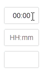
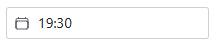

[](https://www.npmjs.com/package/@osvalda/smart-time-input)


[](https://github.com/osvalda/smart-time-input/actions/workflows/node.js.yml)


## Smart Time Input React Component



This React input component is designed specifically to manage time in a 24-hour format, enhancing the user experience through automated features that simplify time entry.

- *Auto Extension and Recognition*: The component automatically extends partial time entries by appending or prefixing zeroes where necessary.
- *Colon Placement*: It intelligently inserts the colon (:) in the correct position.
- *Validation*: The component ensures that only valid time values are accepted, maintaining data integrity.

Try out the [demo app](https://osvalda.github.io/smart-time-input/)

# Install

```bash
npm install @osvalda/smart-time-input --save
```

# Usage

## Use in jsx 

```jsx
import { SmartTimeInput } from '@osvalda/smart-time-input';

//...

return (
    <SmartTimeInput
        initTime={props.init}
        placeholder={props.helpText}
        className='input-fields m2'
        id='time-input'
    />
);
```

## Smart Time Input Props
|Name              |Type      |Requires|Description                               |
|------------------|----------|--------|------------------------------------------|
|initTime          |string    |no      |The initial time value the input will hold|
|className         |string    |no      |Input fields class names                  |
|divClassName      |string    |no      |The wrapper div's class names             |
|onFocusHandler    |FocusEvent|no      |Custom focus handler for the input field  |
|onTimeChange      |FocusEvent|no      |Custom handler when the time has changed  |
|onBlurHandlerSuper|FocusEvent|no      |Custom handler for blur                   |

## Styling and children

The input and optional children components are wrapped aroound a div with own styleing options via classNames.
The input filed can hold icons or interactive elements to enhance its visual appearing. 

Radix ui example:



```jsx
import { SmartTimeInput } from '@osvalda/smart-time-input';

import { CalendarIcon } from '@heroicons/react/24/outline';
import { TextField } from "@radix-ui/themes";

//...

return (
     <SmartTimeInput
        className='rt-reset rt-TextFieldInput'
        divClassName='rt-TextFieldRoot rt-r-size-2 rt-variant-surface'>
        <TextField.Slot>
            <CalendarIcon height="16" width="16" />
        </TextField.Slot>
    </SmartTimeInput>
);
```

# Test
The project uses Jest as test framework with coverage measurement.
Currently unit and component level tests are available.

To run all automated test use the following command:

```bash
npm test
```
